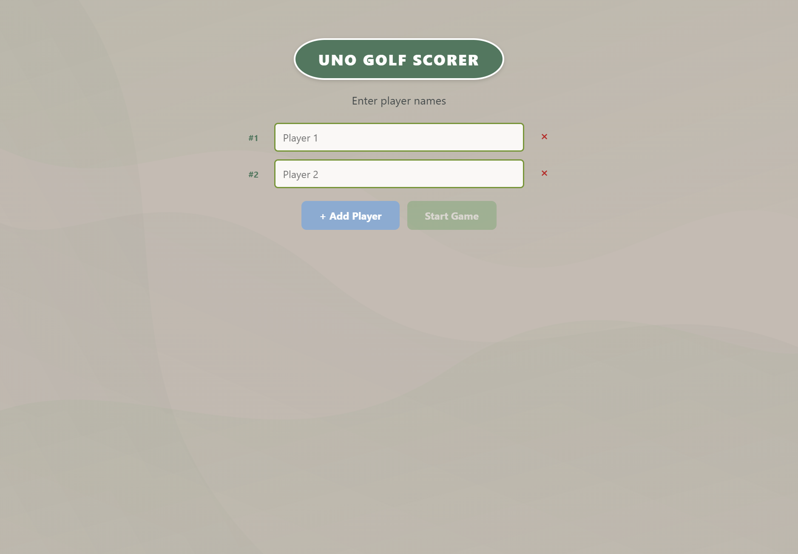

# Uno Golf Scorer 🏌️🃏

A single-file HTML scorekeeping web app for the Mattel card game **Uno Golf**. Track scores across 9 rounds on a digital golf scorecard with UNO card design language — zero dependencies, zero build step.



## Features

- **Player setup** — 2–8 players, add/remove inputs with validation
- **9-round scorecard** — UNO-card-style white rounded cells, column highlighting, leader glow
- **Score entry** — per-player inputs with keyboard navigation (Enter to advance)
- **Final results** — ranked leaderboard with gold trophy highlight for the winner
- **Auto-save** — `localStorage` persistence; resume prompt on reload
- **Responsive** — sticky player names, horizontal scroll, stacked inputs on mobile
- **SVG background** — flowing bezier curves inspired by the Uno Golf box art
- **Zero dependencies** — pure HTML5 / CSS3 / JavaScript (ES6), no frameworks, no build step

## How to Use

1. Open `index.html` in any modern browser — that's it. No server, no install.
2. Enter player names (min 2, max 8).
3. Track scores across 9 rounds. Lower is better (golf rules).
4. After round 9 or clicking "End Game", see the final ranked results.
5. Your game auto-saves to local storage — reload safely.

### Live Demo

Play it on GitHub Pages: `https://<your-username>.github.io/uno-golf-scorer` (after deploying)

## Color Palette

| Usage | Hex |
|-------|-----|
| Background / card surfaces | `#c4bbb3` |
| Header / primary accent | `#53775f` |
| Secondary / buttons | `#6fa067` |
| Text / dark elements | `#262e31` |
| Red (penalties / danger) | `#b42d2a` |
| Olive / dividers | `#78953a` |
| Steel blue accents | `#8cabd1` |
| Gold highlights | `#af9d47` |

## Development

This is a single-file application — just `index.html`. Open it, edit it, ship it.

```bash
# Clone the repo
git clone https://github.com/<your-username>/uno-golf-scorer.git
cd uno-golf-scorer

# No build step — open directly in your browser
start index.html
```
